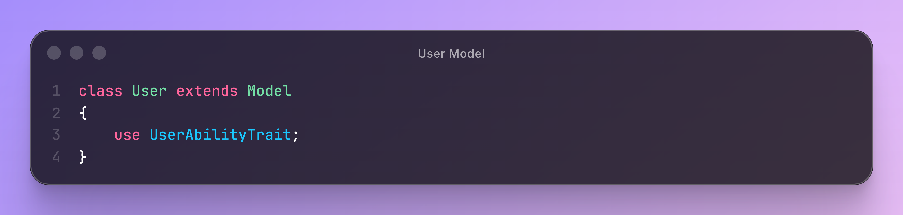
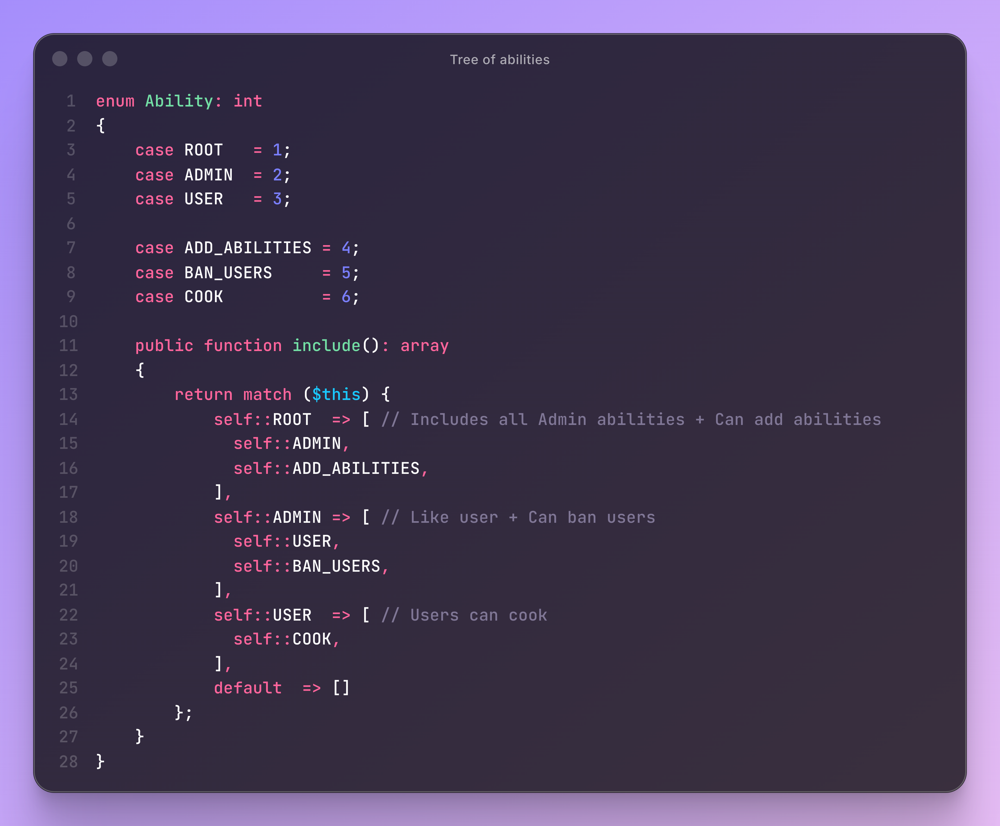
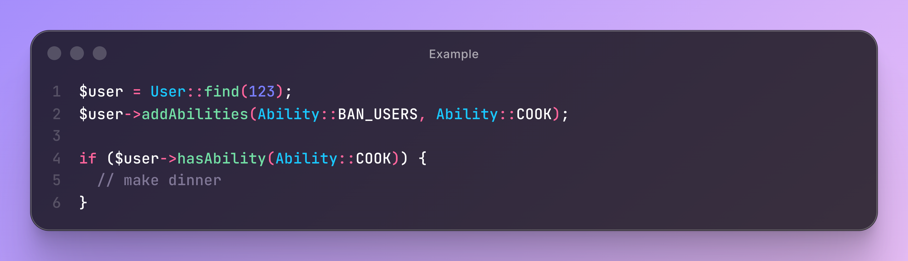

# Abilara
Ability-based authorization for Laravel with nested inheritance, recursive permissions, and unified access control

[](https://packagist.org/packages/perfilov/abilara)
[](https://www.php.net/)
[](https://github.com/PerfilovStanislav/abilara/blob/main/LICENSE)

---

## Install
```bash
composer require perfilov/abilara

php artisan abilara:install

php artisan migrate

composer remove perfilov/abilara
```

---





---

### That's all =))
#### _Write to me if you need additional features_ [ PerfilovStanislav](https://PerfilovStanislav.t.me)